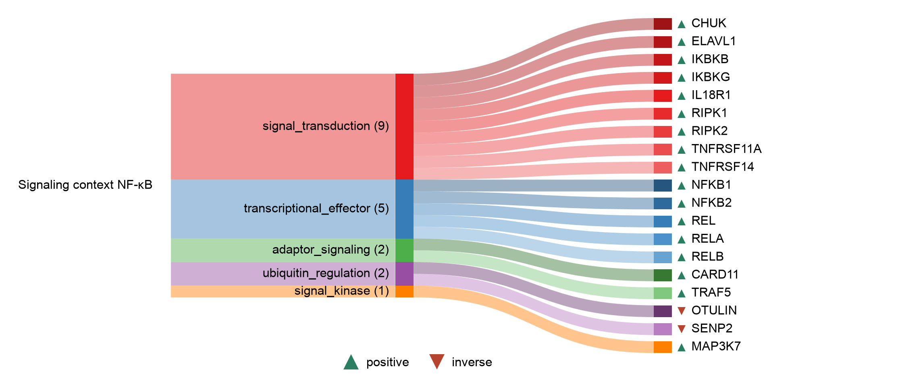

# Signaling context NF-κB

| Gene | HGNC ID | HGNC Symbol | Entrez ID | Module Class | Sensor Family | Activation Tier | Scoring Direction | Cell Type Breadth | Detectability | Also in Module(s) | DOI | Aliases | Is_Sensor | Panel Source | DepMap Essential | s_het | s_het Lower 95% | s_het Upper 95% | UniProt ID | Monomer (kDa) | STRING Sensor Partners |
| --- | --- | --- | --- | --- | --- | --- | --- | --- | --- | --- | --- | --- | --- | --- | --- | --- | --- | --- | --- | --- | --- |
| CARD11 | HGNC:16393 | CARD11 | 84433 | adaptor_signaling |  | early | positive | Immune-enriched | medium |  | [10.1093/emboj/cdf505](https://doi.org/10.1093/emboj/cdf505) |  |  |  | no | 0.120431 | 0.0638501 | 0.200087 | Q9BXL7 | 133.3 | 0 |
| TRAF5 | HGNC:12035 | TRAF5 | 7188 | adaptor_signaling |  | early | positive | Immune-enriched | medium | SIGNALING_CONTEXT_NFKB | [10.1073/pnas.96.17.9803](https://doi.org/10.1073/pnas.96.17.9803) |  |  |  | no | 0.00755859 | 0.0029924 | 0.0140809 | O00463 | 64.4 | 2 |
| MAP3K7 | HGNC:6859 | MAP3K7 | 6885 | signal_kinase | Multi | Active | positive | Broad | medium |  | [10.1038/ni1255](https://doi.org/10.1038/ni1255) |  |  |  | no | 0.193193 | 0.0938489 | 0.336003 | O43318 | 67.2 | 4 |
| CHUK | HGNC:1974 | CHUK | 1147 | signal_transduction |  | Active | positive | Broad | low |  | [10.1002/embr.201337983](https://doi.org/10.1002/embr.201337983) |  |  |  | no | 0.0932332 | 0.0514923 | 0.153954 | O15111 | 84.6 | 5 |
| ELAVL1 | HGNC:3312 | ELAVL1 | 1994 | signal_transduction | Multi | Active | positive | Broad | medium |  | [10.1038/s44318-024-00331-x](https://doi.org/10.1038/s44318-024-00331-x) |  |  |  | no | 0.328092 | 0.0730215 | 0.765512 | Q15717 | 36.1 | 3 |
| IKBKB | HGNC:5960 | IKBKB | 3551 | signal_transduction |  | Active | positive | Broad | medium |  | [10.1002/embr.201337983](https://doi.org/10.1002/embr.201337983) |  |  |  | no | 0.0483198 | 0.020369 | 0.0911715 | O14920 | 86.6 | 6 |
| IKBKG | HGNC:5961 | IKBKG | 8517 | signal_transduction |  | Active | positive | Broad | low |  | [10.1002/embr.201337983](https://doi.org/10.1002/embr.201337983) |  |  |  | no | 0.0678805 | 0.00185438 | 0.249151 | Q9Y6K9 | 48.2 | 8 |
| IL18R1 | HGNC:5988 | IL18R1 | 8809 | signal_transduction |  | early | positive | Immune-enriched | low |  | [10.1074/jbc.272.41.25737](https://doi.org/10.1074/jbc.272.41.25737) | CD218a |  |  | no | 0.00511748 | 0.000978028 | 0.0132017 | Q13478 | 62.3 | 0 |
| RIPK1 | HGNC:10019 | RIPK1 | 8737 | signal_transduction |  | Active | positive | Broad | low |  | [10.1016/S1074-7613(00)80252-6](https://doi.org/10.1016/S1074-7613(00)80252-6) |  |  |  | no | 0.0263155 | 0.0089785 | 0.0487243 | Q13546 | 75.9 | 5 |
| RIPK2 | HGNC:10020 | RIPK2 | 8767 | signal_transduction | Multi | Active | positive | Immune-enriched | low |  | [10.1038/s41467-018-06451-3](https://doi.org/10.1038/s41467-018-06451-3) |  |  |  | no | 0.0576135 | 0.0301826 | 0.0970157 | O43353 | 61.2 | 1 |
| TNFRSF11A | HGNC:11908 | TNFRSF11A | 8792 | signal_transduction |  | early | positive | Immune-enriched | low |  | [10.1074/jbc.274.12.7724](https://doi.org/10.1074/jbc.274.12.7724) | RANK |  |  | no | 0.0310431 | 0.0126494 | 0.0560634 | Q9Y6Q6 | 66.0 | 0 |
| TNFRSF14 | HGNC:11912 | TNFRSF14 | 8764 | signal_transduction |  | Active | positive | Immune-enriched | high |  | [10.1074/jbc.272.22.14029](https://doi.org/10.1074/jbc.272.22.14029) |  |  |  | no | 0.0290464 | 0.00184511 | 0.0825524 | Q92956 | 30.4 | 0 |
| NFKB1 | HGNC:7794 | NFKB1 | 4790 | transcriptional_effector |  | Early | positive | Broad | high | SENESCENCE\|SASP\|SIGNALING_CONTEXT | [10.1101/cshperspect.a000034](https://doi.org/10.1101/cshperspect.a000034) |  |  |  | no | 0.298297 | 0.146788 | 0.498546 | P19838 | 105.4 | 1 |
| NFKB2 | HGNC:7795 | NFKB2 | 4791 | transcriptional_effector |  | Early | positive | Broad | medium | SIGNALING_CONTEXT | [10.1101/cshperspect.a000034](https://doi.org/10.1101/cshperspect.a000034) |  |  |  | no | 0.168956 | 0.0869616 | 0.292046 | Q00653 | 96.7 | 0 |
| REL | HGNC:9954 | REL | 5966 | transcriptional_effector |  | Early | positive | Broad | high | SIGNALING_CONTEXT | [10.1101/cshperspect.a000034](https://doi.org/10.1101/cshperspect.a000034) |  |  |  | no | 0.13 | 0.0628903 | 0.230535 | Q04864 | 68.5 | 0 |
| RELA | HGNC:9955 | RELA | 5970 | transcriptional_effector |  | Early | positive | Broad | low | SASP\|SIGNALING_CONTEXT | [10.1101/cshperspect.a000034](https://doi.org/10.1101/cshperspect.a000034) |  |  |  | no | 0.211534 | 0.097341 | 0.377052 | Q04206 | 60.2 | 3 |
| RELB | HGNC:9956 | RELB | 5971 | transcriptional_effector |  | Early | positive | Broad | medium | SIGNALING_CONTEXT | [10.1101/cshperspect.a000034](https://doi.org/10.1101/cshperspect.a000034) |  |  |  | no | 0.174318 | 0.065892 | 0.358821 | Q01201 | 62.1 | 0 |
| OTULIN | HGNC:25118 | OTULIN | 90268 | ubiquitin_regulation |  | Active | inverse | Broad | medium |  | [10.1016/j.molcel.2014.03.016](https://doi.org/10.1016/j.molcel.2014.03.016) |  |  |  | no | 0.0492051 | 0.0196804 | 0.0942272 | Q96BN8 | 40.3 | 1 |
| SENP2 | HGNC:23116 | SENP2 | 59343 | ubiquitin_regulation | Multi | Active | inverse | Broad | medium |  | [10.1093/jmcb/mjr020](https://doi.org/10.1093/jmcb/mjr020) |  |  |  | no | 0.140311 | 0.0740511 | 0.233669 | Q9HC62 | 67.9 | 0 |
