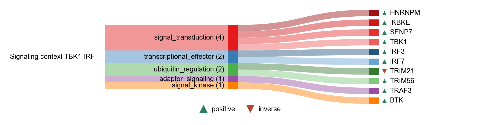

# Signaling context TBK1-IRF

| Gene | Module Class | Sensor Family | Activation Tier | Scoring Direction | Cell Type Breadth | Detectability | Also in Module(s) | DOI | Aliases | Is_Sensor | Panel Source |
| --- | --- | --- | --- | --- | --- | --- | --- | --- | --- | --- | --- |
| TRAF3 | adaptor_signaling | cGAS-STING | Early | positive | Broad | medium | NFKB_CYTOKINE_OUTPUT | [10.1038/s41392-022-01287-2](https://doi.org/10.1038/s41392-022-01287-2) |  |  |  |
| BTK | signal_kinase | cGAS-STING | Active | positive | Immune-enriched | low |  | [10.1016/j.celrep.2015.01.039](https://doi.org/10.1016/j.celrep.2015.01.039) |  |  |  |
| HNRNPM | signal_transduction | Multi | Active | positive | Broad | high |  | [10.1038/s44318-024-00331-x](https://doi.org/10.1038/s44318-024-00331-x) |  |  |  |
| IKBKE | signal_transduction |  | Active | positive | Broad | low |  | [10.1038/ni921](https://doi.org/10.1038/ni921) |  |  |  |
| SENP7 | signal_transduction | cGAS-STING | Active | positive | Broad | high |  | [10.1371/journal.ppat.1006156](https://doi.org/10.1371/journal.ppat.1006156) |  |  |  |
| TBK1 | signal_transduction |  | Early | positive | Broad | medium |  | [10.1038/ni921](https://doi.org/10.1038/ni921) |  |  |  |
| IRF3 | transcriptional_effector |  | Early | positive | Broad | medium |  | [10.1038/ni921](https://doi.org/10.1038/ni921) |  |  |  |
| IRF7 | transcriptional_effector |  | Active | positive | Broad | medium | SIGNALING_CONTEXT | [10.1038/nature03464](https://doi.org/10.1038/nature03464) |  |  |  |
| TRIM21 | ubiquitin_regulation |  | Active | inverse | Broad | low |  | [10.1038/ni.2492](https://doi.org/10.1038/ni.2492) |  |  |  |
| TRIM56 | ubiquitin_regulation | cGAS-STING | Active | positive | Broad | medium |  | [10.1038/s41467-018-02936-3](https://doi.org/10.1038/s41467-018-02936-3) |  |  |  |
