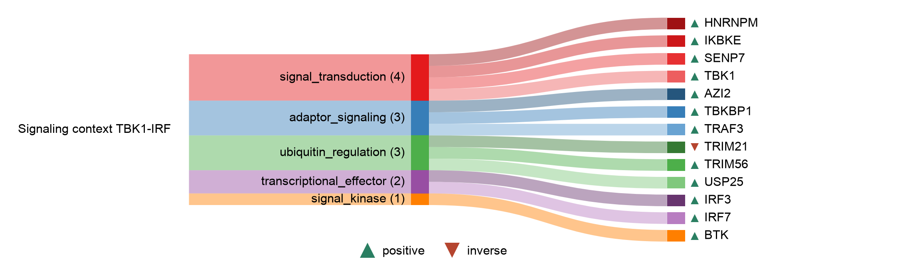

# Signaling context TBK1-IRF

| Gene | HGNC ID | HGNC Symbol | Entrez ID | Module Class | Sensor Family | Scoring Direction | Single-Cell Detectability | Also in Module(s) | DOI | Aliases | Is_Sensor | Panel Source | DepMap Essential | s_het | s_het Lower 95% | s_het Upper 95% | UniProt ID | Monomer (kDa) | STRING Sensor Partners | STRING Partners |
| --- | --- | --- | --- | --- | --- | --- | --- | --- | --- | --- | --- | --- | --- | --- | --- | --- | --- | --- | --- | --- |
| AZI2 | HGNC:24002 | AZI2 | 64343 | adaptor_signaling | Multi | positive | medium | SIGNALING_CONTEXT_TLR | [10.4049/jimmunol.177.12.8676](https://doi.org/10.4049/jimmunol.177.12.8676) | NAP1 |  |  | no | 0.0294717 | 0.014123 | 0.049728 | Q9H6S1 | 44.9 | 0 | 22 |
| TBKBP1 | HGNC:30140 | TBKBP1 | 9755 | adaptor_signaling |  | positive | low |  | [10.1038/sj.emboj.7601743](https://doi.org/10.1038/sj.emboj.7601743) |  |  |  | no | 0.0384563 | 0.0164222 | 0.0775375 | A7MCY6 | 67.7 | 0 | 17 |
| TRAF3 | HGNC:12033 | TRAF3 | 7187 | adaptor_signaling | cGAS-STING | positive | medium | NFKB_CYTOKINE_OUTPUT | [10.1038/s41392-022-01287-2](https://doi.org/10.1038/s41392-022-01287-2) |  |  |  | no | 0.187071 | 0.100339 | 0.304817 | Q13114 | 64.5 | 5 | 173 |
| BTK | HGNC:1133 | BTK | 695 | signal_kinase | cGAS-STING | positive | low |  | [10.1016/j.celrep.2015.01.039](https://doi.org/10.1016/j.celrep.2015.01.039) |  |  |  | no | 0.361292 | 0.129422 | 0.677081 | Q06187 | 76.3 | 1 | 113 |
| HNRNPM | HGNC:5046 | HNRNPM | 4670 | signal_transduction | Multi | positive | high |  | [10.1038/s44318-024-00331-x](https://doi.org/10.1038/s44318-024-00331-x) |  |  |  | yes | 0.582288 | 0.183453 | 0.954394 | P52272 | 77.5 | 7 | 291 |
| IKBKE | HGNC:14552 | IKBKE | 9641 | signal_transduction |  | positive | low |  | [10.1038/ni921](https://doi.org/10.1038/ni921) |  |  |  | no | 0.0338742 | 0.018382 | 0.0536429 | Q14164 | 80.5 | 3 | 78 |
| SENP7 | HGNC:30402 | SENP7 | 57337 | signal_transduction | cGAS-STING | positive | high |  | [10.1371/journal.ppat.1006156](https://doi.org/10.1371/journal.ppat.1006156) |  |  |  | no | 0.0468083 | 0.0246894 | 0.0820204 | Q9BQF6 | 119.7 | 0 | 13 |
| TBK1 | HGNC:11584 | TBK1 | 29110 | signal_transduction |  | positive | medium |  | [10.1038/ni921](https://doi.org/10.1038/ni921) |  |  |  | no | 0.0464553 | 0.0269761 | 0.0709412 | Q9UHD2 | 83.6 | 5 | 202 |
| IRF3 | HGNC:6118 | IRF3 | 3661 | transcriptional_effector |  | positive | medium |  | [10.1038/ni921](https://doi.org/10.1038/ni921) |  |  |  | no | 0.0194102 | 0.0065341 | 0.0378978 | Q14653 | 47.2 | 4 | 114 |
| IRF7 | HGNC:6122 | IRF7 | 3665 | transcriptional_effector |  | positive | medium | SIGNALING_CONTEXT | [10.1038/nature03464](https://doi.org/10.1038/nature03464) |  |  |  | no | 0.0016852 | 0.000177989 | 0.00508512 | Q92985 | 54.3 | 6 | 66 |
| TRIM21 | HGNC:11312 | TRIM21 | 6737 | ubiquitin_regulation |  | inverse | low |  | [10.1038/ni.2492](https://doi.org/10.1038/ni.2492) |  |  |  | no | 0.00679083 | 0.00256383 | 0.0131512 | P19474 | 54.2 | 7 | 619 |
| TRIM56 | HGNC:19028 | TRIM56 | 81844 | ubiquitin_regulation | cGAS-STING | positive | medium |  | [10.1038/s41467-018-02936-3](https://doi.org/10.1038/s41467-018-02936-3) |  |  |  | no | 0.0163778 | 0.00398251 | 0.033968 | Q9BRZ2 | 81.5 | 3 | 53 |
| USP25 | HGNC:12624 | USP25 | 29761 | ubiquitin_regulation | Multi | positive | high | SIGNALING_CONTEXT_NFKB | [10.1073/pnas.1509968112](https://doi.org/10.1073/pnas.1509968112) |  |  |  | no | 0.0506295 | 0.0332258 | 0.0734506 | Q9UHP3 | 122.2 | 2 | 57 |
