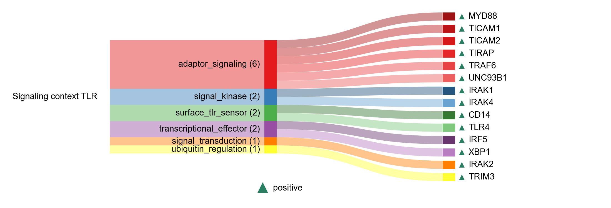

# Signaling context TLR

| Gene | Module Class | Sensor Family | Activation Tier | Scoring Direction | Cell Type Breadth | Detectability | Also in Module(s) | DOI | Aliases | Is_Sensor | Panel Source |
| --- | --- | --- | --- | --- | --- | --- | --- | --- | --- | --- | --- |
| MYD88 | adaptor_signaling | TLR | Early | positive | Broad | medium |  | [10.1038/ni758](https://doi.org/10.1038/ni758) |  |  |  |
| TICAM1 | adaptor_signaling | TLR | Early | positive | Broad | low | NASP_RNA_SENSING | [10.1038/ni886](https://doi.org/10.1038/ni886) |  |  |  |
| TICAM2 | adaptor_signaling | TLR | Early | positive | Immune-enriched | low |  | [10.1038/nri1391](https://doi.org/10.1038/nri1391) |  |  |  |
| TIRAP | adaptor_signaling | TLR | Early | positive | Broad | low |  | [10.1155/2023/2899271](https://doi.org/10.1155/2023/2899271) |  |  |  |
| TRAF6 | adaptor_signaling | cGAS-STING | Early | positive | Broad | low |  | [10.1016/j.bbrc.2019.05.022](https://doi.org/10.1016/j.bbrc.2019.05.022) |  |  |  |
| UNC93B1 | adaptor_signaling | TLR | Early | positive | Broad | low |  | [10.7554/eLife.00291](https://doi.org/10.7554/eLife.00291) |  |  |  |
| IRAK1 | signal_kinase | TLR | Early | positive | Broad | low | SIGNALING_CONTEXT\|IFN_I_OUTPUT | [10.1084/jem.20042372](https://doi.org/10.1084/jem.20042372) |  |  |  |
| IRAK4 | signal_kinase | TLR | Early | positive | Broad | low | SIGNALING_CONTEXT\|IFN_I_OUTPUT | [10.1016/j.immuni.2005.09.016](https://doi.org/10.1016/j.immuni.2005.09.016) |  |  |  |
| IRAK2 | signal_transduction | TLR | Active | positive | Broad | medium |  | [10.3389/fimmu.2023.1133354](https://doi.org/10.3389/fimmu.2023.1133354) |  |  |  |
| CD14 | surface_tlr_sensor | TLR | early | positive | Myeloid-enriched | high |  | [10.1016/j.cell.2011.09.051](https://doi.org/10.1016/j.cell.2011.09.051) |  |  |  |
| TLR4 | surface_tlr_sensor | TLR | Post-NASP | positive | Adipose/Immune-enriched | medium | NFKB_CYTOKINE_OUTPUT | [10.3892/ijmm.2020.4530](https://doi.org/10.3892/ijmm.2020.4530) |  | lps_sensor |  |
| IRF5 | transcriptional_effector |  | Active | positive | Immune-enriched | low |  | [10.1093/intimm/dxy032](https://doi.org/10.1093/intimm/dxy032) |  |  |  |
| XBP1 | transcriptional_effector | TLR | Active | positive | Broad | high |  | [10.1038/ni.1857](https://doi.org/10.1038/ni.1857) |  |  |  |
| TRIM3 | ubiquitin_regulation | TLR | Active | positive | Broad | low |  | [10.1073/pnas.2002472117](https://doi.org/10.1073/pnas.2002472117) |  |  |  |
