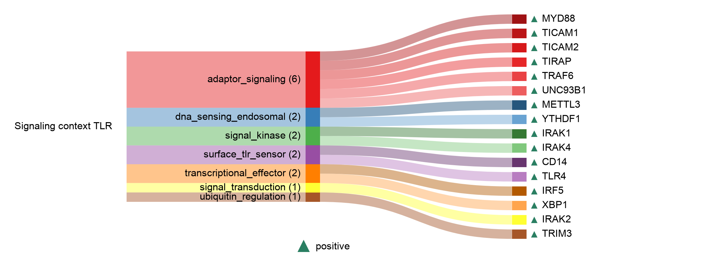

# Signaling context TLR

| Gene | HGNC ID | HGNC Symbol | Entrez ID | Module Class | Sensor Family | Scoring Direction | Single-Cell Detectability | Also in Module(s) | DOI | Aliases | Is_Sensor | Panel Source | DepMap Essential | s_het | s_het Lower 95% | s_het Upper 95% | UniProt ID | Monomer (kDa) | STRING Sensor Partners | STRING Partners |
| --- | --- | --- | --- | --- | --- | --- | --- | --- | --- | --- | --- | --- | --- | --- | --- | --- | --- | --- | --- | --- |
| MYD88 | HGNC:7562 | MYD88 | 4615 | adaptor_signaling | TLR | positive | medium |  | [10.1038/ni758](https://doi.org/10.1038/ni758) |  |  |  | no | 0.0237659 | 0.00885597 | 0.0446924 | Q99836 | 33.2 | 7 | 84 |
| TICAM1 | HGNC:18348 | TICAM1 | 148022 | adaptor_signaling | TLR | positive | low | NASP_RNA_SENSING | [10.1038/ni886](https://doi.org/10.1038/ni886) |  |  |  | no | 0.0219156 | 0.00210825 | 0.0722743 | Q8IUC6 | 76.4 | 5 | 61 |
| TICAM2 | HGNC:21354 | TICAM2 | 353376 | adaptor_signaling | TLR | positive | low |  | [10.1038/nri1391](https://doi.org/10.1038/nri1391) |  |  |  | no | 0.00383446 | 0.000897195 | 0.00916715 | Q86XR7 | 26.9 | 4 | 42 |
| TIRAP | HGNC:17192 | TIRAP | 114609 | adaptor_signaling | TLR | positive | low |  | [10.1155/2023/2899271](https://doi.org/10.1155/2023/2899271) |  |  |  | no | 0.000759334 | 8.62213e-05 | 0.00239341 | P58753 | 23.9 | 4 | 42 |
| TRAF6 | HGNC:12036 | TRAF6 | 7189 | adaptor_signaling | cGAS-STING | positive | low |  | [10.1016/j.bbrc.2019.05.022](https://doi.org/10.1016/j.bbrc.2019.05.022) |  |  |  | no | 0.124155 | 0.0516268 | 0.235379 | Q9Y4K3 | 59.6 | 9 | 370 |
| UNC93B1 | HGNC:13481 | UNC93B1 | 81622 | adaptor_signaling | TLR | positive | low |  | [10.7554/eLife.00291](https://doi.org/10.7554/eLife.00291) |  |  |  | no | 0.0129106 | 0.000415153 | 0.0509121 | Q9H1C4 | 66.6 | 4 | 17 |
| METTL3 | HGNC:17563 | METTL3 | 56339 | dna_sensing_endosomal | TLR | positive | low |  | [10.1016/j.jbc.2024.107226](https://doi.org/10.1016/j.jbc.2024.107226) |  |  |  | yes | 0.0173537 | 0.00863755 | 0.0304512 | Q86U44 | 64.5 | 2 | 248 |
| YTHDF1 | HGNC:15867 | YTHDF1 | 54915 | dna_sensing_endosomal | TLR | positive | low |  | [10.1016/j.jbc.2024.107226](https://doi.org/10.1016/j.jbc.2024.107226) |  |  |  | no | 0.20563 | 0.0883972 | 0.377654 | Q9BYJ9 | 60.9 | 5 | 225 |
| IRAK1 | HGNC:6112 | IRAK1 | 3654 | signal_kinase | TLR | positive | low | SIGNALING_CONTEXT\|IFN_I_OUTPUT | [10.1084/jem.20042372](https://doi.org/10.1084/jem.20042372) |  |  |  | no | 0.140864 | 0.0420269 | 0.340456 | P51617 | 76.5 | 3 | 118 |
| IRAK4 | HGNC:17967 | IRAK4 | 51135 | signal_kinase | TLR | positive | low | SIGNALING_CONTEXT\|IFN_I_OUTPUT | [10.1016/j.immuni.2005.09.016](https://doi.org/10.1016/j.immuni.2005.09.016) |  |  |  | no | 0.00207388 | 0.000213857 | 0.00667202 | Q9NWZ3 | 51.5 | 2 | 41 |
| IRAK2 | HGNC:6113 | IRAK2 | 3656 | signal_transduction | TLR | positive | medium |  | [10.3389/fimmu.2023.1133354](https://doi.org/10.3389/fimmu.2023.1133354) |  |  |  | no | 0.00101907 | 0.000156305 | 0.00286568 | O43187 | 69.4 | 4 | 40 |
| CD14 | HGNC:1628 | CD14 | 929 | surface_tlr_sensor | TLR | positive | high |  | [10.1016/j.cell.2011.09.051](https://doi.org/10.1016/j.cell.2011.09.051) |  |  |  | no | 0.001718 | 0.000115924 | 0.00599425 | P08571 | 40.1 | 0 | 39 |
| TLR4 | HGNC:11850 | TLR4 | 7099 | surface_tlr_sensor | TLR | positive | medium | NFKB_CYTOKINE_OUTPUT | [10.3892/ijmm.2020.4530](https://doi.org/10.3892/ijmm.2020.4530) |  | lps_sensor |  | no | 0.00281602 | 0.000821745 | 0.00601443 | O00206 | 95.7 | 4 | 109 |
| IRF5 | HGNC:6120 | IRF5 | 3663 | transcriptional_effector |  | positive | low |  | [10.1093/intimm/dxy032](https://doi.org/10.1093/intimm/dxy032) |  |  |  | no | 0.0210662 | 0.00898414 | 0.0386397 | Q13568 | 56.0 | 0 | 34 |
| XBP1 | HGNC:12801 | XBP1 | 7494 | transcriptional_effector | TLR | positive | high |  | [10.1038/ni.1857](https://doi.org/10.1038/ni.1857) |  |  |  | no | 0.0522458 | 0.0209584 | 0.102895 | P17861 | 28.7 | 0 | 34 |
| TRIM3 | HGNC:10064 | TRIM3 | 10612 | ubiquitin_regulation | TLR | positive | low |  | [10.1073/pnas.2002472117](https://doi.org/10.1073/pnas.2002472117) |  |  |  | no | 0.122934 | 0.0727312 | 0.190007 | O75382 | 80.8 | 1 | 38 |
